# MASTER_FLOW

Below are 30 flows (Mermaid flowchart) with traceability to requirements and stories. Each flow includes an ID and references corresponding sequences in MASTER_SEQUENCE (SEQ-XXX).

## FLW-001: Home Loads Posts
- Trace: REQ-001, US-001 → SEQ-001
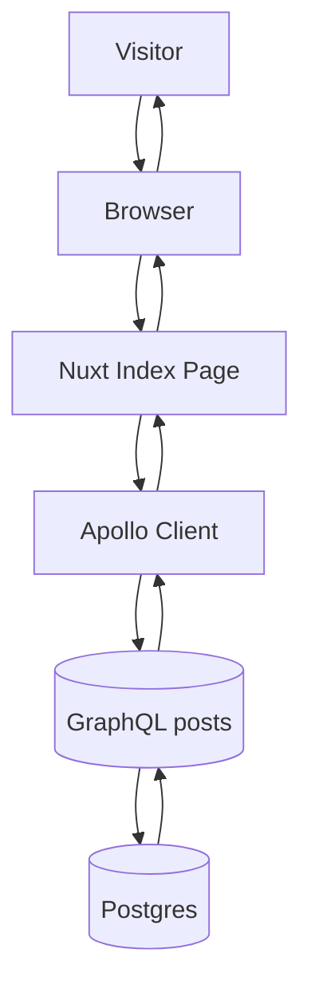

## FLW-002: Search Posts by Keyword
- Trace: REQ-003, US-003 → SEQ-002
```mermaid
flowchart TD
U --> B --> F
F -->|keyword| A --> GQ[(posts(keyword))]
GQ --> DB
DB --> GQ --> A --> F --> B --> U
```

## FLW-003: Filter by Category
- Trace: REQ-004, US-004 → SEQ-003
```mermaid
flowchart TD
U --> F
F --> A --> GQ[(categories)] --> DB --> GQ
F --> A --> GQ2[(posts(category_id))] --> DB --> GQ2 --> A --> F --> U
```

## FLW-004: View Post Detail
- Trace: REQ-002, US-002 → SEQ-004
```mermaid
flowchart TD
U --> F[Nuxt Post Page]
F --> A --> GQ[(post(id))] --> DB --> GQ --> A --> F --> U
```

## FLW-005: Register User
- Trace: REQ-010, US-010 → SEQ-005
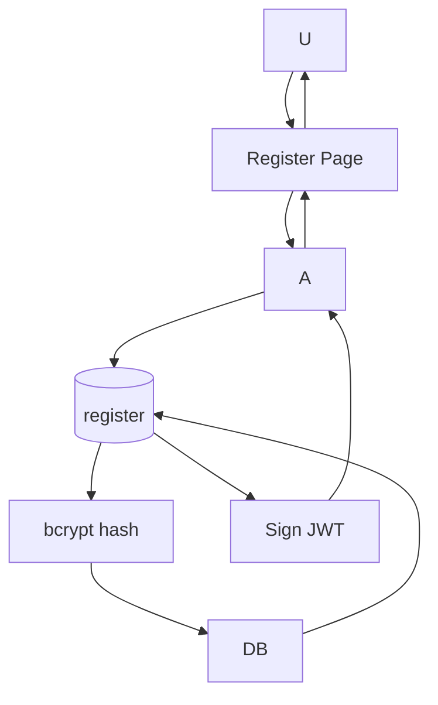

## FLW-006: Login User
- Trace: REQ-011, US-011 → SEQ-006
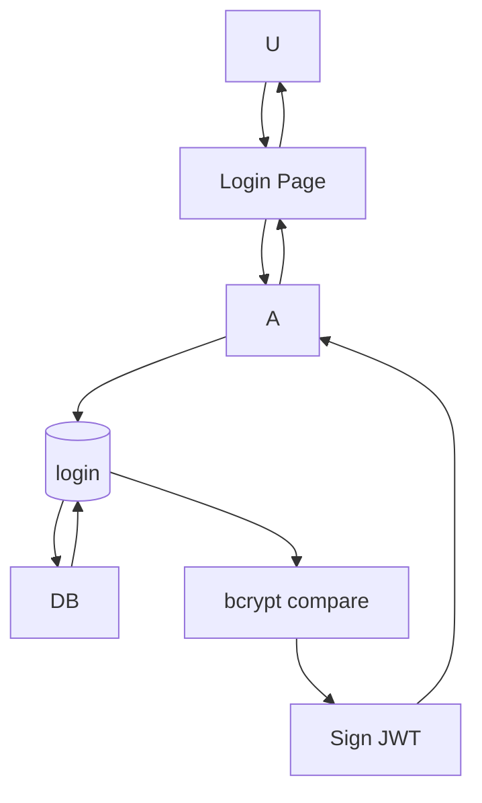

## FLW-007: Auth Context Parsing
- Trace: REQ-012, US-012 → SEQ-007
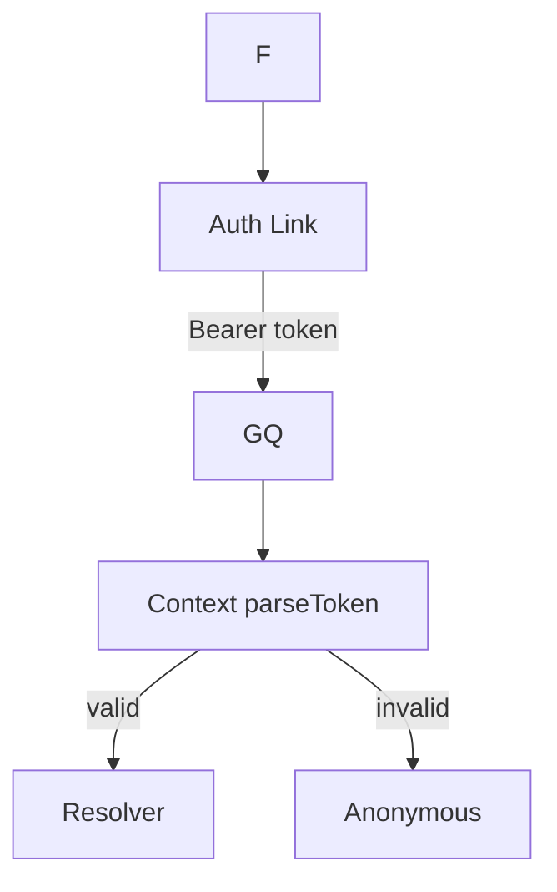

## FLW-008: Admin Route Guard
- Trace: REQ-013, US-013 → SEQ-008
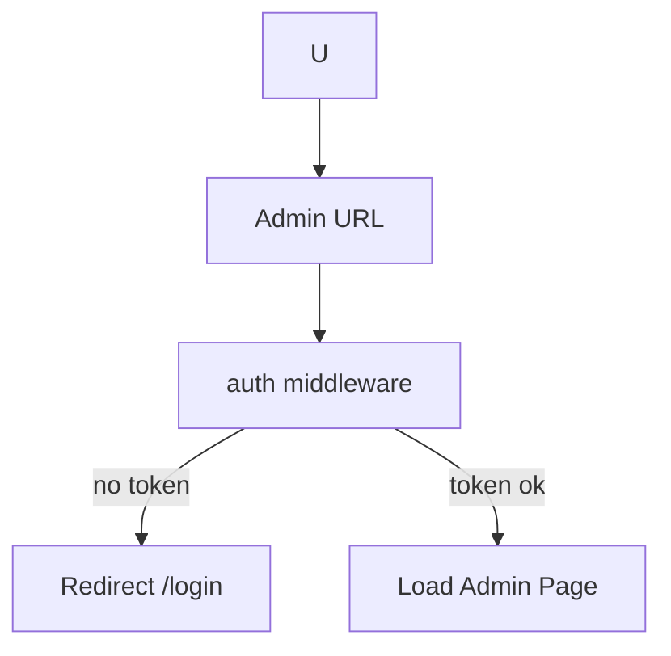

## FLW-009: Admin List Posts
- Trace: REQ-020, US-020 → SEQ-009
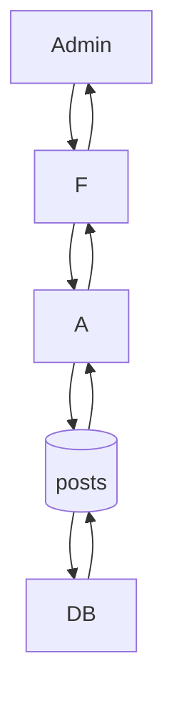

## FLW-010: Create Post
- Trace: REQ-021, US-021 → SEQ-010
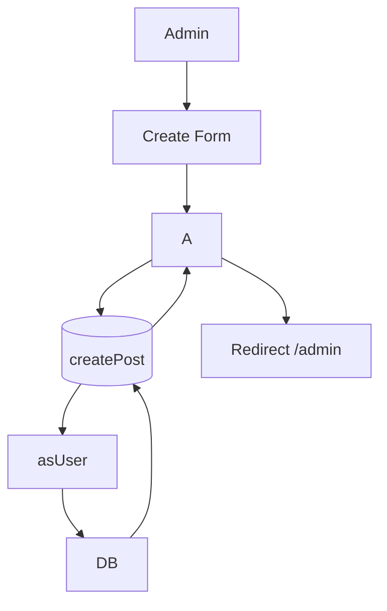

## FLW-011: Edit Post
- Trace: REQ-022, US-022 → SEQ-011
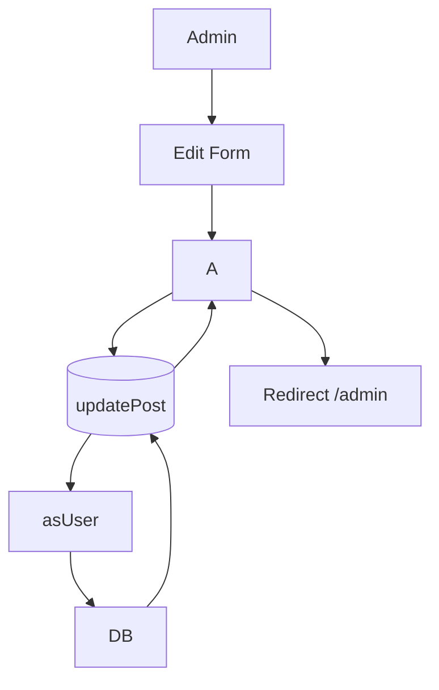

## FLW-012: Delete Post
- Trace: REQ-023, US-023 → SEQ-012
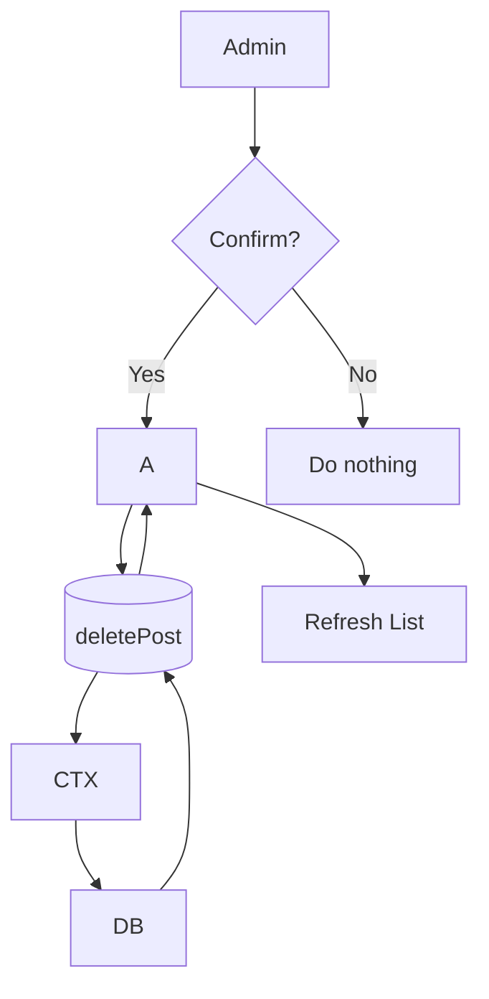

## FLW-013: Create Category
- Trace: REQ-024, US-024 → SEQ-013
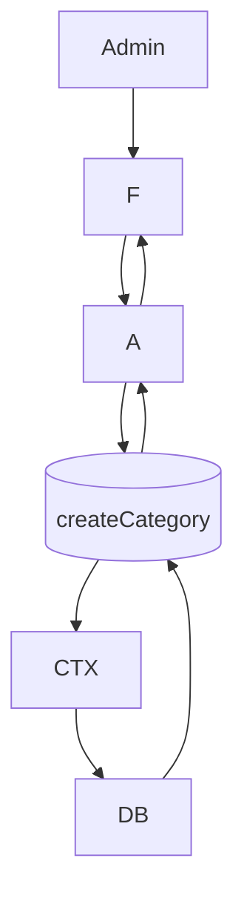

## FLW-014: Health Check
- Trace: REQ-030, US-030 → SEQ-014
```mermaid
flowchart TD
Monitor -->|GET /health| Express
Express --> OK[{ ok: true }]
```

## FLW-015: Run Migrations
- Trace: REQ-032, US-032 → SEQ-015
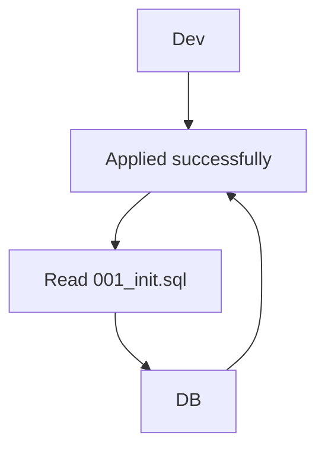

## FLW-016: Docker Compose Up
- Trace: REQ-033, US-033 → SEQ-016
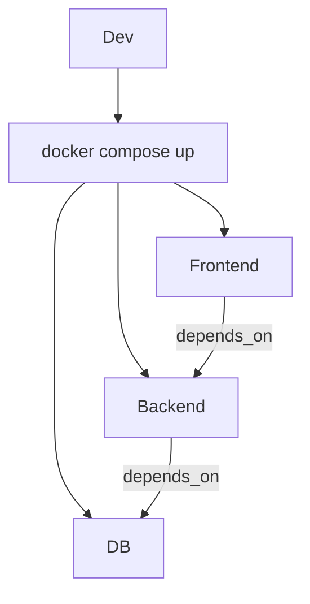

## FLW-017: Token Expired Handling (UX)
- Trace: REQ-043, US-042 → SEQ-017
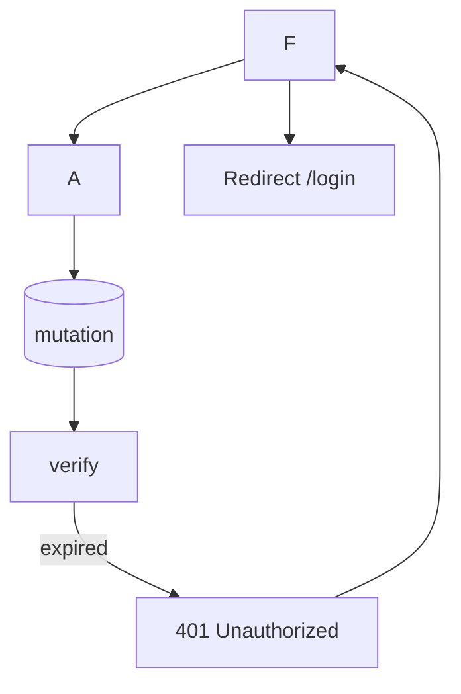

## FLW-018: Invalid Login Attempt
- Trace: REQ-011, US-011 → SEQ-018
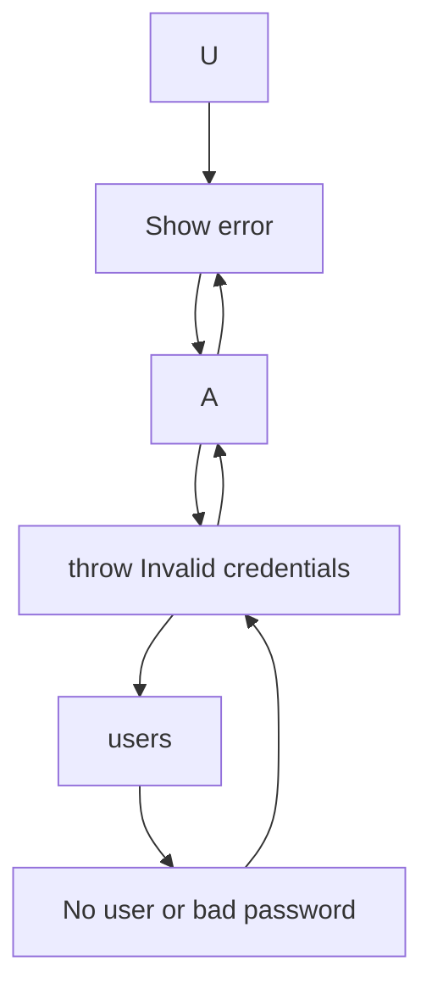

## FLW-019: Unauthorized Create Post
- Trace: REQ-013, US-013 → SEQ-019
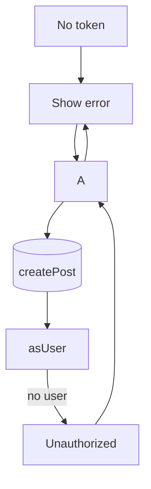

## FLW-020: Post Not Found
- Trace: REQ-002, US-002 → SEQ-020
```mermaid
flowchart TD
U --> F[Post Detail]
F --> A --> GQ[(post(id))]
GQ --> DB
DB --> None[0 rows]
None --> GQ[return null]
GQ --> A --> F[Show Not Found]
```

## FLW-021: Network Failure on Query
- Trace: REQ-001, US-001 → SEQ-021
```mermaid
flowchart TD
F --> A
A --> Net[Network]
Net -->|timeout| Err[Error]
Err --> F[Loading false, show message]
```

## FLW-022: Missing JWT Header
- Trace: REQ-012, US-012 → SEQ-022
```mermaid
flowchart TD
F --> A
A --> GQ
GQ --> CTX[parseToken]
CTX --> Null[null user]
Null --> RES[Public resolver path]
```

## FLW-023: DB Connectivity Error
- Trace: REQ-031, US-031 → SEQ-023
```mermaid
flowchart TD
RES[Resolver] --> DB
DB -->|conn error| Err[PG Error]
Err --> RES[throw]
RES --> A --> F[Show error]
```

## FLW-024: Rate Limiting (Proposed)
- Trace: REQ-034 (future), US-034 → SEQ-024
```mermaid
flowchart TD
Client --> Proxy[Rate Limit]
Proxy -->|over limit| 429
Proxy -->|ok| Backend
```

## FLW-025: Pagination (Proposed)
- Trace: REQ-052, US-052 → SEQ-025
```mermaid
flowchart TD
U --> F
F --> A --> GQ[(posts(limit, offset))]
GQ --> DB
DB --> GQ[rows, total]
GQ --> A --> F[Render pages]
```

## FLW-026: SEO Meta Injection
- Trace: REQ-005, US-005 → SEQ-026
```mermaid
flowchart TD
Route --> NuxtHead
NuxtHead --> Meta[title, description]
Meta --> Browser
```

## FLW-027: Render Image URL
- Trace: REQ-021/002, US-002/021 → SEQ-027
```mermaid
flowchart TD
Post{image_url?} -->|yes| Img[Render ]
Post -->|no| Skip[No image]
```

## FLW-028: Content Sanitization (Proposed)
- Trace: REQ-041, US-041 → SEQ-028
```mermaid
flowchart TD
Input[Post content] --> Sanitize[Sanitize/escape]
Sanitize --> Store[DB]
Store --> Render[Safe render]
```

## FLW-029: Audit Logging (Proposed)
- Trace: REQ-034, US-034 → SEQ-029
```mermaid
flowchart TD
Action[Mutation] --> Logger
Logger --> Sink[JSON logs]
Sink --> Store[Central storage]
```

## FLW-030: Inspect DB with Adminer
- Trace: REQ-033, US-033 → SEQ-030
```mermaid
flowchart TD
Dev --> Adminer
Adminer -->|connect| DB
DB --> Adminer[Browse tables]
```

