# MASTER_SEQUENCE

30 sequence diagrams corresponding 1:1 with MASTER_FLOW. Each references requirements and stories.

## SEQ-001: Home Loads Posts (FLW-001)
- Trace: REQ-001, US-001
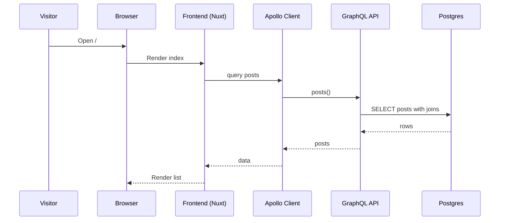
```mermaid
sequenceDiagram
  participant U as Visitor
  participant B as Browser
  participant F as Frontend (Nuxt)
  participant A as Apollo Client
  participant S as GraphQL API
  participant D as Postgres
  U->>B: Open /
  B->>F: Render index
  F->>A: query posts
  A->>S: posts()
  S->>D: SELECT posts with joins
  D-->>S: rows
  S-->>A: posts
  A-->>F: data
  F-->>B: Render list
```

## SEQ-002: Search Posts by Keyword (FLW-002)
- Trace: REQ-003, US-003
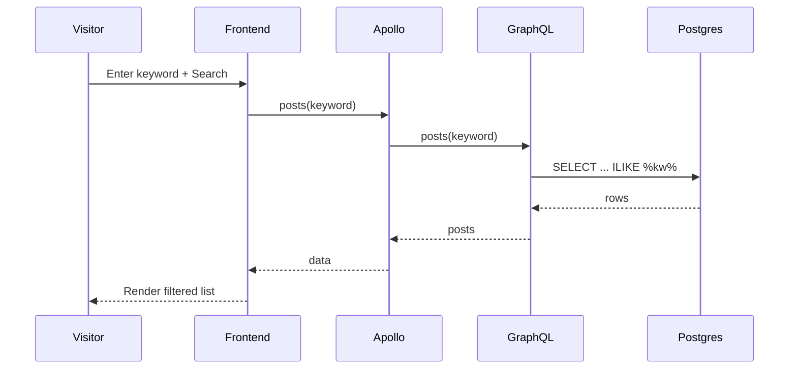
```mermaid
sequenceDiagram
  participant U as Visitor
  participant F as Frontend
  participant A as Apollo
  participant S as GraphQL
  participant D as Postgres
  U->>F: Enter keyword + Search
  F->>A: posts(keyword)
  A->>S: posts(keyword)
  S->>D: SELECT ... ILIKE %kw%
  D-->>S: rows
  S-->>A: posts
  A-->>F: data
  F-->>U: Render filtered list
```

## SEQ-003: Filter by Category (FLW-003)
- Trace: REQ-004, US-004
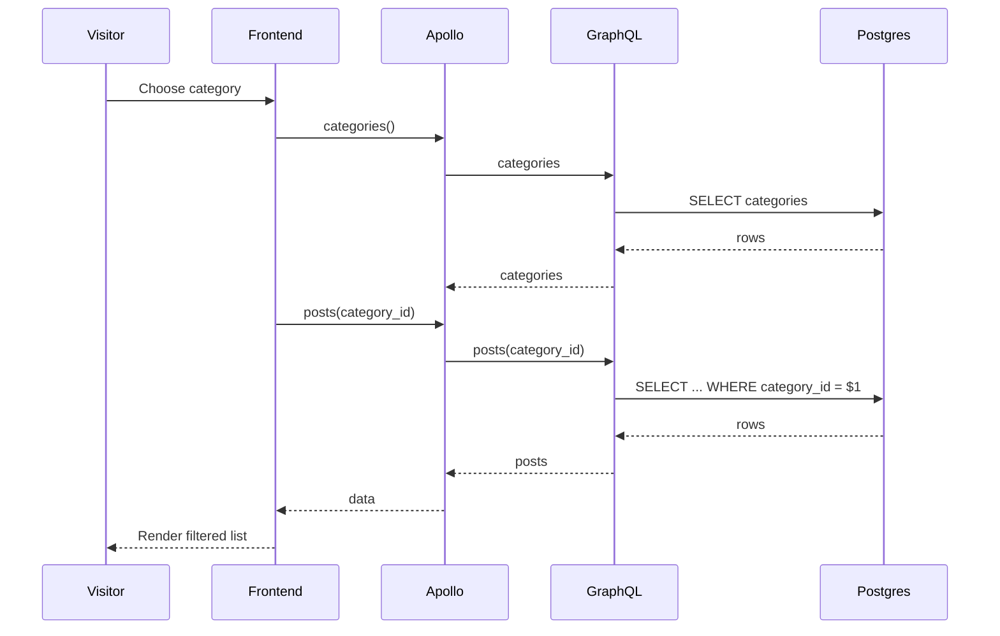
```mermaid
sequenceDiagram
  participant U as Visitor
  participant F as Frontend
  participant A as Apollo
  participant S as GraphQL
  participant D as Postgres
  U->>F: Choose category
  F->>A: categories()
  A->>S: categories
  S->>D: SELECT categories
  D-->>S: rows
  S-->>A: categories
  F->>A: posts(category_id)
  A->>S: posts(category_id)
  S->>D: SELECT ... WHERE category_id = $1
  D-->>S: rows
  S-->>A: posts
  A-->>F: data
  F-->>U: Render filtered list
```

## SEQ-004: View Post Detail (FLW-004)
- Trace: REQ-002, US-002
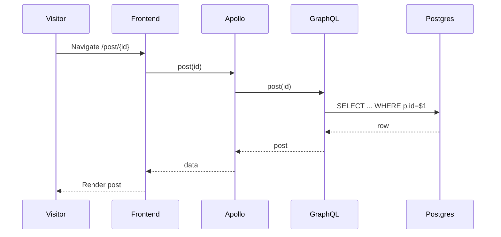
```mermaid
sequenceDiagram
  participant U as Visitor
  participant F as Frontend
  participant A as Apollo
  participant S as GraphQL
  participant D as Postgres
  U->>F: Navigate /post/{id}
  F->>A: post(id)
  A->>S: post(id)
  S->>D: SELECT ... WHERE p.id=$1
  D-->>S: row
  S-->>A: post
  A-->>F: data
  F-->>U: Render post
```

## SEQ-005: Register User (FLW-005)
- Trace: REQ-010, US-010
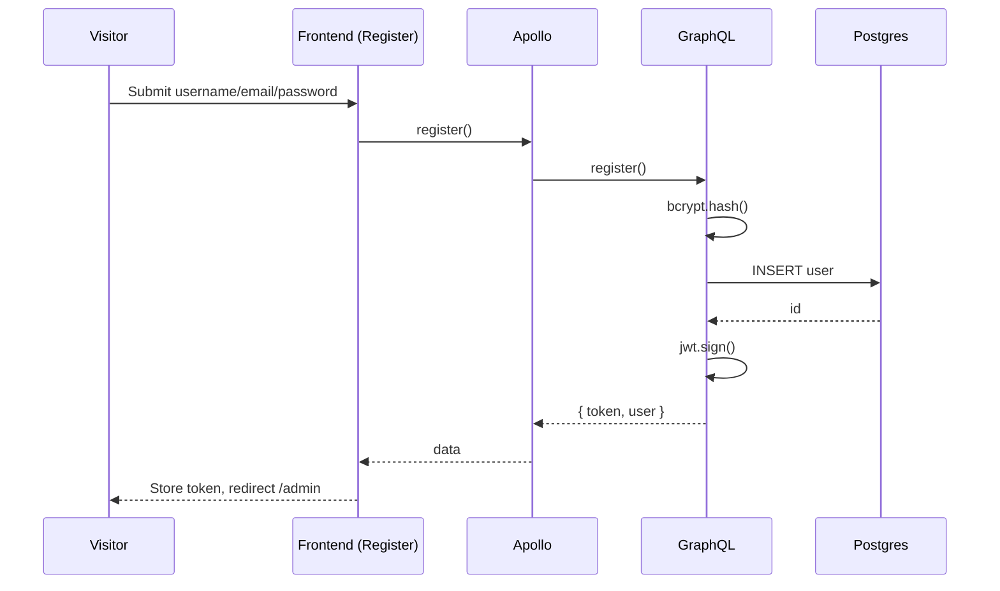
```mermaid
sequenceDiagram
  participant U as Visitor
  participant F as Frontend (Register)
  participant A as Apollo
  participant S as GraphQL
  participant D as Postgres
  U->>F: Submit username/email/password
  F->>A: register()
  A->>S: register()
  S->>S: bcrypt.hash()
  S->>D: INSERT user
  D-->>S: id
  S->>S: jwt.sign()
  S-->>A: { token, user }
  A-->>F: data
  F-->>U: Store token, redirect /admin
```

## SEQ-006: Login User (FLW-006)
- Trace: REQ-011, US-011
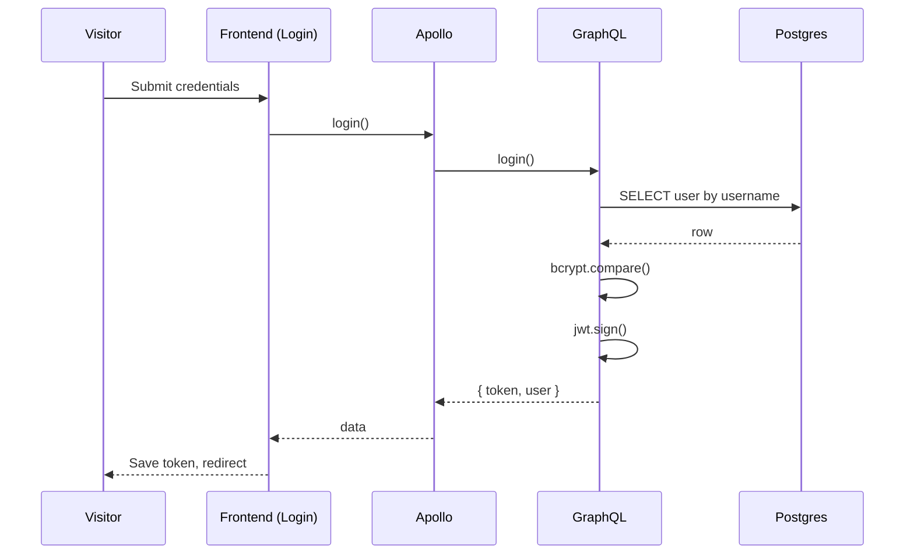
```mermaid
sequenceDiagram
  participant U as Visitor
  participant F as Frontend (Login)
  participant A as Apollo
  participant S as GraphQL
  participant D as Postgres
  U->>F: Submit credentials
  F->>A: login()
  A->>S: login()
  S->>D: SELECT user by username
  D-->>S: row
  S->>S: bcrypt.compare()
  S->>S: jwt.sign()
  S-->>A: { token, user }
  A-->>F: data
  F-->>U: Save token, redirect
```

## SEQ-007: Auth Context Parsing (FLW-007)
- Trace: REQ-012, US-012
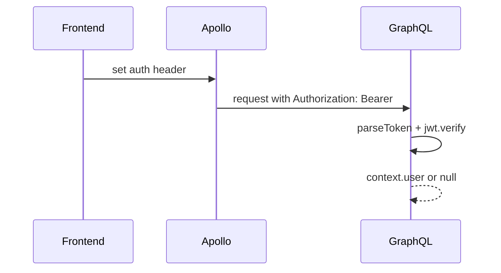
```mermaid
sequenceDiagram
  participant F as Frontend
  participant A as Apollo
  participant S as GraphQL
  F->>A: set auth header
  A->>S: request with Authorization: Bearer
  S->>S: parseToken + jwt.verify
  S-->>S: context.user or null
```

## SEQ-008: Admin Route Guard (FLW-008)
- Trace: REQ-013, US-013
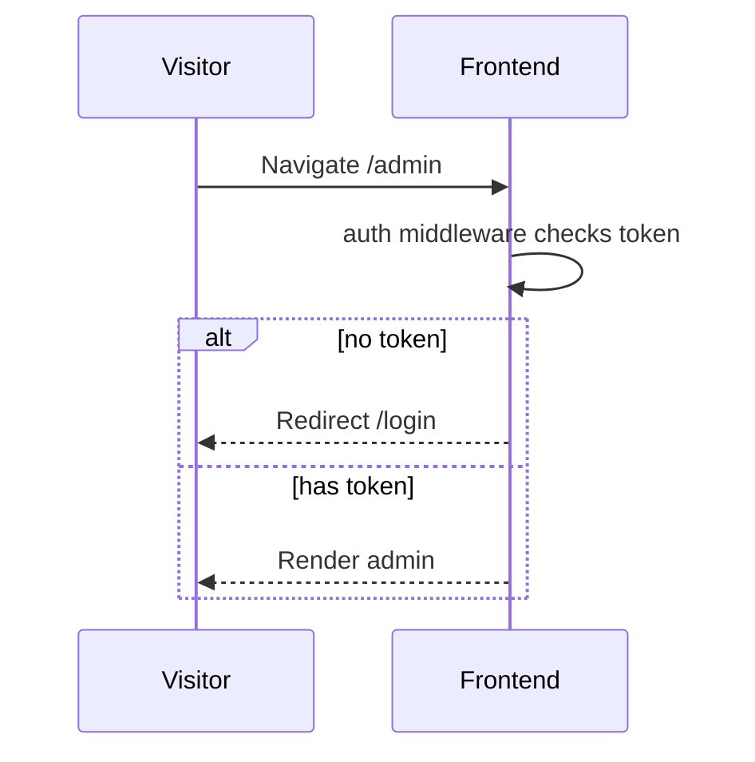
```mermaid
sequenceDiagram
  participant U as Visitor
  participant F as Frontend
  U->>F: Navigate /admin
  F->>F: auth middleware checks token
  alt no token
    F-->>U: Redirect /login
  else has token
    F-->>U: Render admin
  end
```

## SEQ-009: Admin List Posts (FLW-009)
- Trace: REQ-020, US-020
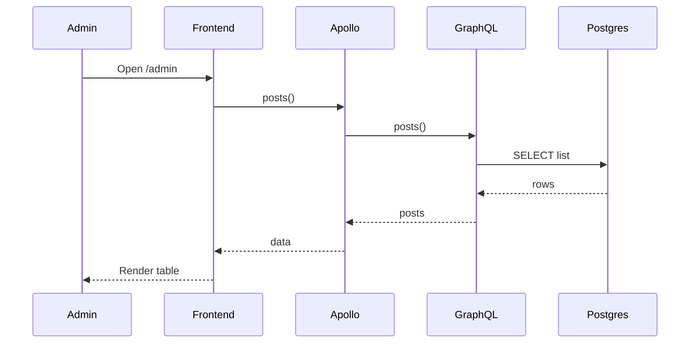
```mermaid
sequenceDiagram
  participant Admin
  participant F as Frontend
  participant A as Apollo
  participant S as GraphQL
  participant D as Postgres
  Admin->>F: Open /admin
  F->>A: posts()
  A->>S: posts()
  S->>D: SELECT list
  D-->>S: rows
  S-->>A: posts
  A-->>F: data
  F-->>Admin: Render table
```

## SEQ-010: Create Post (FLW-010)
- Trace: REQ-021, US-021
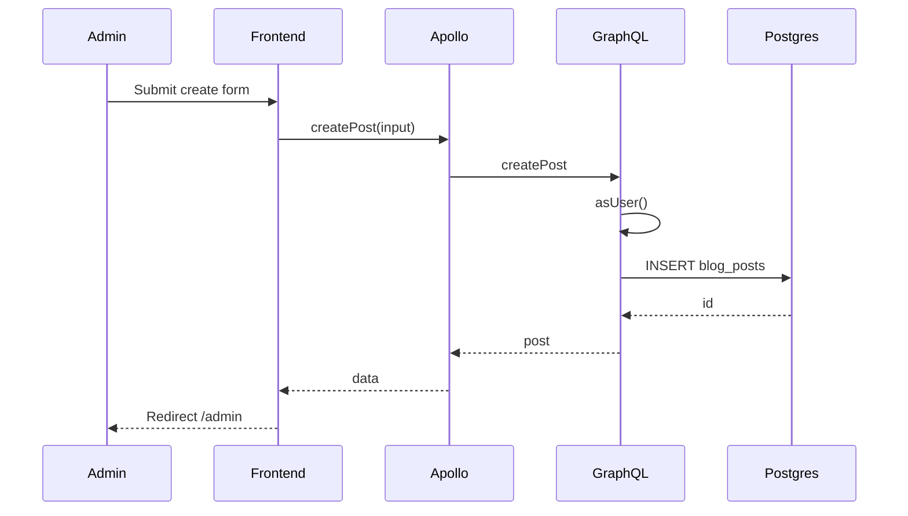
```mermaid
sequenceDiagram
  participant Admin
  participant F as Frontend
  participant A as Apollo
  participant S as GraphQL
  participant D as Postgres
  Admin->>F: Submit create form
  F->>A: createPost(input)
  A->>S: createPost
  S->>S: asUser()
  S->>D: INSERT blog_posts
  D-->>S: id
  S-->>A: post
  A-->>F: data
  F-->>Admin: Redirect /admin
```

## SEQ-011: Edit Post (FLW-011)
- Trace: REQ-022, US-022
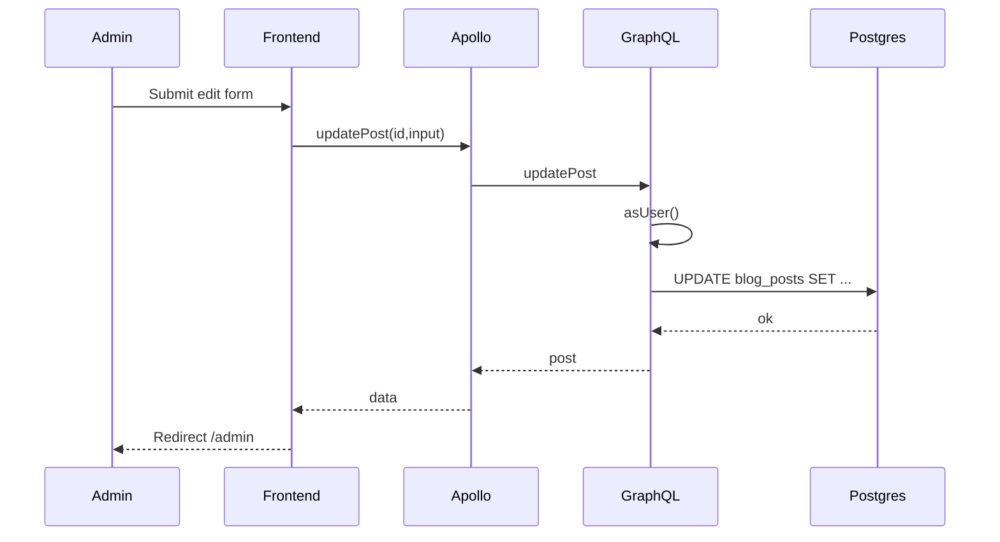
```mermaid
sequenceDiagram
  participant Admin
  participant F as Frontend
  participant A as Apollo
  participant S as GraphQL
  participant D as Postgres
  Admin->>F: Submit edit form
  F->>A: updatePost(id,input)
  A->>S: updatePost
  S->>S: asUser()
  S->>D: UPDATE blog_posts SET ...
  D-->>S: ok
  S-->>A: post
  A-->>F: data
  F-->>Admin: Redirect /admin
```

## SEQ-012: Delete Post (FLW-012)
- Trace: REQ-023, US-023
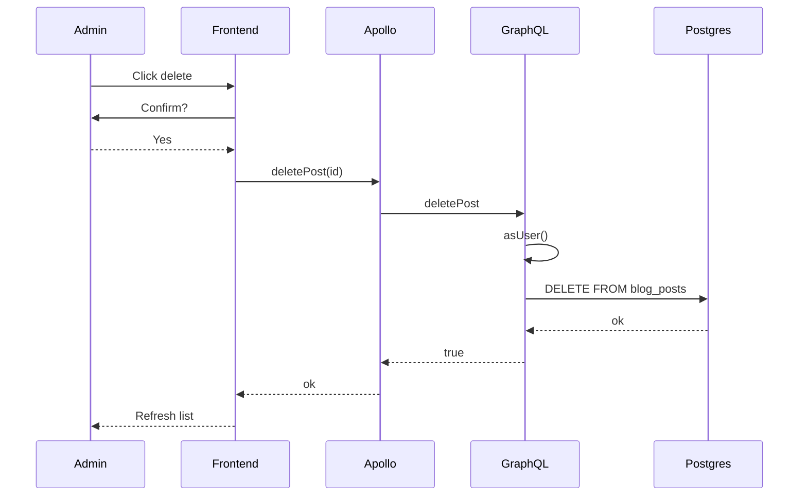
```mermaid
sequenceDiagram
  participant Admin
  participant F as Frontend
  participant A as Apollo
  participant S as GraphQL
  participant D as Postgres
  Admin->>F: Click delete
  F->>Admin: Confirm?
  Admin-->>F: Yes
  F->>A: deletePost(id)
  A->>S: deletePost
  S->>S: asUser()
  S->>D: DELETE FROM blog_posts
  D-->>S: ok
  S-->>A: true
  A-->>F: ok
  F-->>Admin: Refresh list
```

## SEQ-013: Create Category (FLW-013)
- Trace: REQ-024, US-024
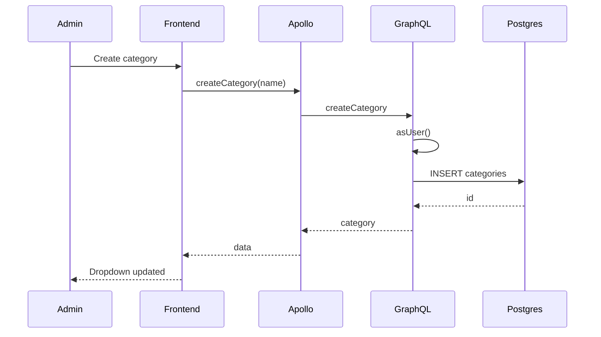
```mermaid
sequenceDiagram
  participant Admin
  participant F as Frontend
  participant A as Apollo
  participant S as GraphQL
  participant D as Postgres
  Admin->>F: Create category
  F->>A: createCategory(name)
  A->>S: createCategory
  S->>S: asUser()
  S->>D: INSERT categories
  D-->>S: id
  S-->>A: category
  A-->>F: data
  F-->>Admin: Dropdown updated
```

## SEQ-014: Health Check (FLW-014)
- Trace: REQ-030, US-030
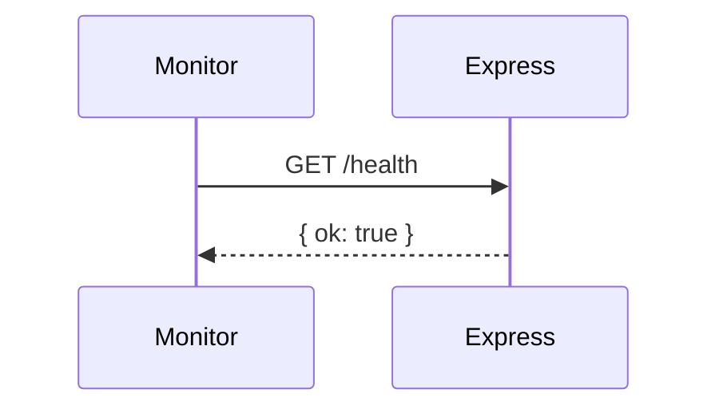
```mermaid
sequenceDiagram
  participant M as Monitor
  participant X as Express
  M->>X: GET /health
  X-->>M: { ok: true }
```

## SEQ-015: Run Migrations (FLW-015)
- Trace: REQ-032, US-032
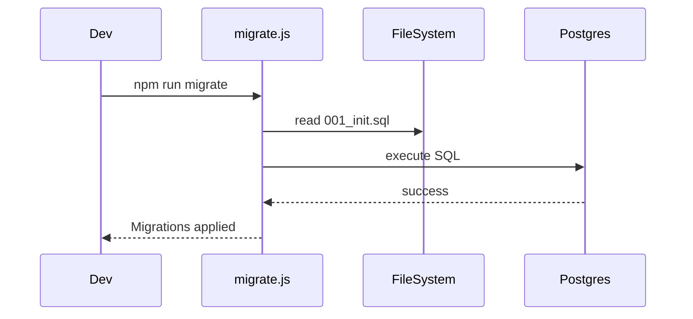
```mermaid
sequenceDiagram
  participant Dev
  participant Scr as migrate.js
  participant FS as FileSystem
  participant D as Postgres
  Dev->>Scr: npm run migrate
  Scr->>FS: read 001_init.sql
  Scr->>D: execute SQL
  D-->>Scr: success
  Scr-->>Dev: Migrations applied
```

## SEQ-016: Docker Compose Up (FLW-016)
- Trace: REQ-033, US-033
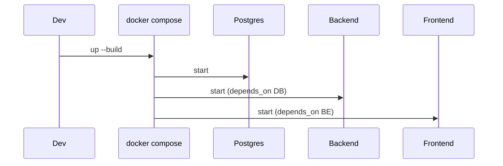
```mermaid
sequenceDiagram
  participant Dev
  participant C as docker compose
  participant DB as Postgres
  participant BE as Backend
  participant FE as Frontend
  Dev->>C: up --build
  C->>DB: start
  C->>BE: start (depends_on DB)
  C->>FE: start (depends_on BE)
```

## SEQ-017: Token Expired Handling (FLW-017)
- Trace: REQ-043, US-042
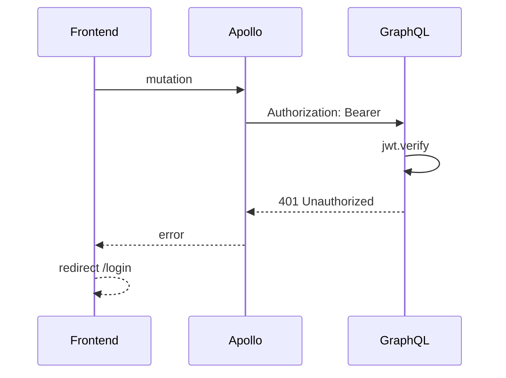
```mermaid
sequenceDiagram
  participant F as Frontend
  participant A as Apollo
  participant S as GraphQL
  F->>A: mutation
  A->>S: Authorization: Bearer
  S->>S: jwt.verify
  S-->>A: 401 Unauthorized
  A-->>F: error
  F-->>F: redirect /login
```

## SEQ-018: Invalid Login Attempt (FLW-018)
- Trace: REQ-011, US-011
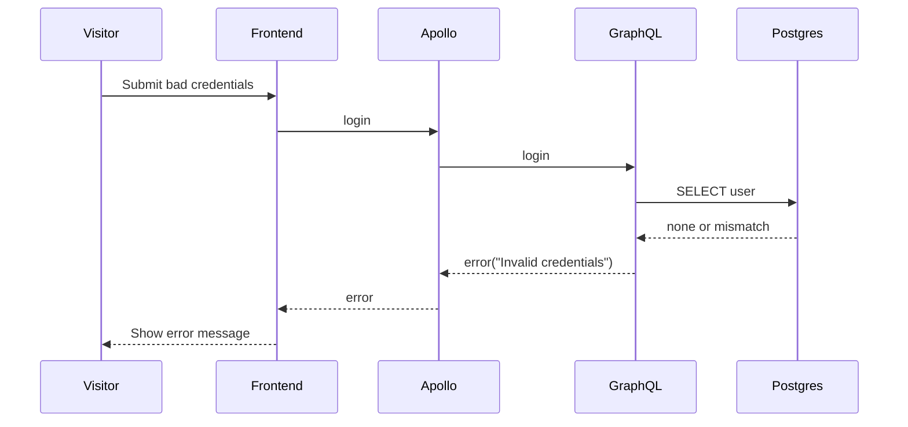
```mermaid
sequenceDiagram
  participant U as Visitor
  participant F as Frontend
  participant A as Apollo
  participant S as GraphQL
  participant D as Postgres
  U->>F: Submit bad credentials
  F->>A: login
  A->>S: login
  S->>D: SELECT user
  D-->>S: none or mismatch
  S-->>A: error("Invalid credentials")
  A-->>F: error
  F-->>U: Show error message
```

## SEQ-019: Unauthorized Create Post (FLW-019)
- Trace: REQ-013, US-013
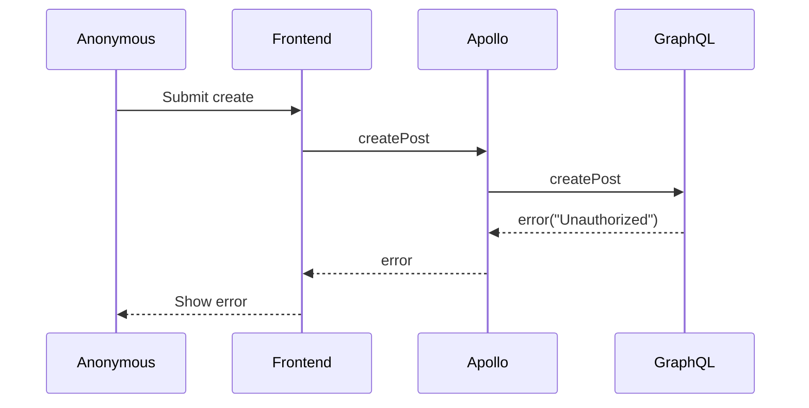
```mermaid
sequenceDiagram
  participant U as Anonymous
  participant F as Frontend
  participant A as Apollo
  participant S as GraphQL
  U->>F: Submit create
  F->>A: createPost
  A->>S: createPost
  S-->>A: error("Unauthorized")
  A-->>F: error
  F-->>U: Show error
```

## SEQ-020: Post Not Found (FLW-020)
- Trace: REQ-002, US-002
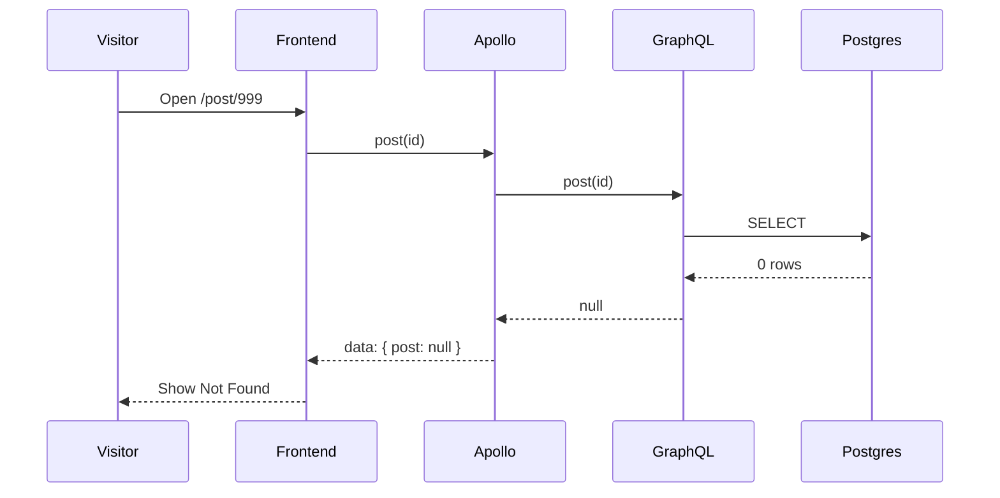
```mermaid
sequenceDiagram
  participant U as Visitor
  participant F as Frontend
  participant A as Apollo
  participant S as GraphQL
  participant D as Postgres
  U->>F: Open /post/999
  F->>A: post(id)
  A->>S: post(id)
  S->>D: SELECT
  D-->>S: 0 rows
  S-->>A: null
  A-->>F: data: { post: null }
  F-->>U: Show Not Found
```

## SEQ-021: Network Failure on Query (FLW-021)
- Trace: REQ-001, US-001
```mermaid
sequenceDiagram
  participant F as Frontend
  participant A as Apollo
  participant Net as Network
  F->>A: posts
  A->>Net: HTTP
  Net-->>A: timeout
  A-->>F: error
  F-->>F: loading=false; show error
```

## SEQ-022: Missing JWT Header (FLW-022)
- Trace: REQ-012, US-012
```mermaid
sequenceDiagram
  participant F as Frontend
  participant A as Apollo
  participant S as GraphQL
  F->>A: query public
  A->>S: no Authorization
  S-->>A: ok (public)
```

## SEQ-023: DB Connectivity Error (FLW-023)
- Trace: REQ-031, US-031
```mermaid
sequenceDiagram
  participant S as GraphQL
  participant D as Postgres
  participant A as Apollo
  participant F as Frontend
  S->>D: query
  D-->>S: connection error
  S-->>A: error
  A-->>F: error
  F-->>F: Show error message
```

## SEQ-024: Rate Limiting (Proposed) (FLW-024)
- Trace: REQ-034, US-034
```mermaid
sequenceDiagram
  participant C as Client
  participant RL as RateLimiter
  participant S as Backend
  C->>RL: request
  alt Over limit
    RL-->>C: 429
  else Allowed
    RL->>S: forward
    S-->>C: response
  end
```

## SEQ-025: Pagination (Proposed) (FLW-025)
- Trace: REQ-052, US-052
```mermaid
sequenceDiagram
  participant U as Visitor
  participant F as Frontend
  participant A as Apollo
  participant S as GraphQL
  participant D as Postgres
  U->>F: Click next page
  F->>A: posts(limit,offset)
  A->>S: posts(limit,offset)
  S->>D: SELECT ... LIMIT/OFFSET
  D-->>S: rows, total
  S-->>A: data
  A-->>F: data
  F-->>U: Render page
```

## SEQ-026: SEO Meta Injection (FLW-026)
- Trace: REQ-005, US-005
```mermaid
sequenceDiagram
  participant R as Nuxt Router
  participant H as Nuxt Head
  participant B as Browser
  R->>H: set title/description
  H-->>B: render meta tags
```

## SEQ-027: Render Image URL (FLW-027)
- Trace: REQ-021/002, US-002/021
```mermaid
sequenceDiagram
  participant F as Frontend
  participant U as User
  F->>F: if post.image_url
  alt has image
    F-->>U: Render <img src>
  else no image
    F-->>U: No image displayed
  end
```

## SEQ-028: Content Sanitization (Proposed) (FLW-028)
- Trace: REQ-041, US-041
```mermaid
sequenceDiagram
  participant F as Frontend
  participant S as Sanitizer
  participant D as DB
  F->>S: sanitize(content)
  S-->>F: safe content
  F->>D: store
```

## SEQ-029: Audit Logging (Proposed) (FLW-029)
- Trace: REQ-034, US-034
```mermaid
sequenceDiagram
  participant S as Backend
  participant L as Logger
  participant C as Collector
  S->>L: log JSON
  L->>C: ship logs
```

## SEQ-030: Inspect DB with Adminer (FLW-030)
- Trace: REQ-033, US-033
```mermaid
sequenceDiagram
  participant Dev
  participant A as Adminer
  participant D as Postgres
  Dev->>A: open UI
  A->>D: connect
  D-->>A: schemas
  A-->>Dev: browse tables
```

